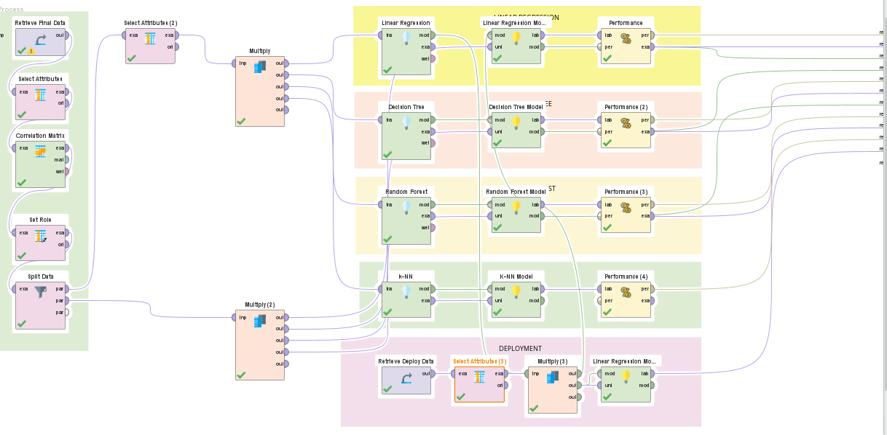
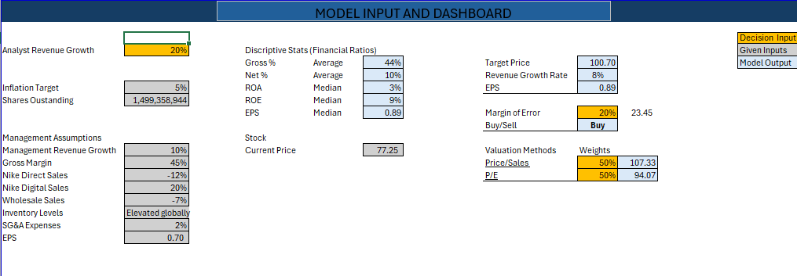

# NIKE Financial Analytics, Revenue Forecasting & Stock valuation
### Financial Analysis Dashboard + Machine Learning Revenue Prediction + Stock Valuation | Webster University

[](https://github.com/amitlamsal/nike-financial-analytics-revenue-forecasting)
[](https://github.com/amitlamsal/nike-financial-analytics-revenue-forecasting)
[](https://github.com/amitlamsal/nike-financial-analytics-revenue-forecasting)


---

## Project Overview

This repository presents a comprehensive three-part financial analytics study of NIKE Inc. — combining descriptive analytics, predictive machine learning and investment decision modeling to deliver a complete 360-degree view of NIKE's financial position, future revenue trajectory and stock valuation.

The project was completed across three courses at Webster University and demonstrates the full spectrum of financial analytics capabilities — from historical performance visualization to forward-looking revenue forecasting to data-driven investment recommendations.

| Aspect | Part 1 — Financial Dashboard | Part 2 — Revenue Forecasting | Part 3 — Stock Valuation |
|---|---|---|---|
| **Type** | Descriptive Analytics | Predictive Analytics | Investment Decision Analytics |
| **Tool** | Power BI | RapidMiner | Excel |
| **Data Period** | 5 years (2019–2023) | 20 years (2009–2024 quarterly) | 24 quarters (2019–2024) |
| **Data Source** | Nike.com, SEC.gov | Nike.com, SEC.gov, Federal Reserve, World Bank | Nike.com, SEC.gov, Competitor filings |
| **Focus** | Financial health visualization | Future revenue prediction | Stock target price and Buy/Sell recommendation |
| **Key Output** | Revenue outperformed benchmark by 36.7% | Linear Regression selected as optimal model | Target price $100.70 — BUY recommendation |
| **Course** | Data Visualization | Machine Learning for Business | Data Analytics for Managers |

---

### The Business Questions This Project Answers

- **How has NIKE performed financially over the past 5 years** and does it demonstrate the strength of a market leader?
- **Can we accurately predict NIKE's future quarterly revenue** using financial and macroeconomic variables?
- **Is NIKE stock undervalued or overvalued** at its current market price and what is the data-driven investment recommendation?
- **How does NIKE compare to its competitors** on key valuation multiples and financial metrics?
- **What macroeconomic factors** drive NIKE revenue and how strong is their predictive relationship?
---

## Part 1 — Financial Analytics Dashboard (Power BI)

### Business Question
How has NIKE Inc. performed financially over the 2019–2023 period and does it demonstrate the financial strength of a market leader?

### Dataset
Financial data sourced from Nike.com and SEC.gov covering:
- **Income Statement:** Revenue, Cost of Sales, Gross Profit, Net Income
- **Balance Sheet:** Total Assets, Total Liabilities, Shareholders Equity

### Dashboard Analysis

**1. Revenue vs Cost of Sales Trend**
Nike's revenue consistently outpaced cost of sales across 2019–2023. A significant dip occurred in Q2 2020 due to COVID-19 but recovered sharply by Q3 2020. By 2023 revenue reached new highs demonstrating operational resilience.

**2. Gross Profit Comparison**
Gross profit grew steadily from $16K million in 2020 to $22K million in 2023 — reflecting improved pricing strategy and cost control.

**3. Liquidity Analysis**
Liquidity spiked in Q3 2020 as a precautionary measure during pandemic uncertainty. Post-2021 liquidity normalized above pre-pandemic levels indicating efficient cash management.

**4. Assets vs Liabilities**
Total assets consistently exceeded total liabilities across all 5 years — peak asset levels in 2021 and 2022 reaching approximately $150K million. Confirms strong financial stability and low insolvency risk.

**5. Net Profit Margin Trend**
Sharp decline to -20% in Q2 2020 due to COVID-19. Swift recovery above 10% from Q3 2020 onwards — stabilizing and trending upward through 2023.

**6. Revenue vs Industry Expectation**
NIKE total revenue of $218.99K million significantly outperformed the industry benchmark of $80.37K million — a 36.7% surplus above expectations confirming market leadership.

### Key Findings

| Metric | Value | Insight |
|---|---|---|
| Total Revenue (5 years) | $218.99K million | 36.7% above industry benchmark |
| Total Gross Profit | $97.45K million | Strong cost management |
| Total Net Income | $22.82K million | 10.4% of total revenues |
| COVID-19 Impact | Q2 2020 margin -20% | Recovered fully by Q3 2020 |
| Asset-to-Liability ratio | Assets > Liabilities all years | Financially stable throughout |

**Financial Analysis Dashboard**


**Comparison Dashboard**


---

## Part 2 — Revenue Forecasting (RapidMiner Machine Learning)

### Business Question
Can we accurately predict NIKE's future quarterly revenue using financial indicators and macroeconomic variables?

### Dataset
20-year quarterly dataset (2009–2024) combining:

| Variable Type | Variables |
|---|---|
| **Financial Attributes** | Revenue, Total Assets, Total Liabilities, Long-Term Debt, CAPEX, Cash on Hand |
| **Macroeconomic Variables** | GDP Growth Rate, Unemployment Rate, Inflation Rate |
| **Competitor Data** | Adidas financial metrics |
| **Data Sources** | Nike.com, SEC.gov, FRED St. Louis, World Bank |

### Models Tested

| Model | R² | RMSE | Absolute Error | Selected |
|---|---|---|---|---|
| Linear Regression | Good | Low | Low | ✅ Selected |
| Decision Tree | Better | Lower | Lower | ❌ |
| Random Forest | Better | Lower | Lower | ❌ |
| KNN | Best | Lowest | Lowest | ❌ |

### Why Linear Regression Was Selected Over KNN

Despite KNN outperforming all models on performance metrics it was not selected for three reasons:

- **Time Series Limitation** — KNN is not suitable for predicting time series data with a global trend
- **Computational Cost** — Model efficiency decreases significantly with large datasets
- **Data Dependency** — KNN accuracy depends heavily on availability and quality of historical data

Linear Regression was selected as the final model for its interpretability, suitability for time series forecasting and consistent performance.

### Model Details

- **Data Split:** 60% training / 40% testing
- **Deployment:** Created a deployment dataset with updated variable values to generate future revenue predictions
- **Tool:** RapidMiner Studio

**RapidMiner Process Design**



**Model Prediction Result**


---

## Part 3 — Stock Valuation & Investment Decision Model (Excel)
### Business Question
**Is NIKE stock undervalued or overvalued** at its current market price and what is the data-driven investment recommendation?

A sophisticated Excel-based financial decision model combining competitor analysis, financial ratio analysis and regression modeling to generate a target stock price and Buy/Sell recommendation.

**Excel Valuation Model Screenshot**



**Model Inputs:**
- Analyst revenue growth assumptions
- Management guidance — Nike Direct, Digital, Wholesale, SG&A
- Inflation target and shares outstanding

**Model Outputs:**

| Output | Value |
|---|---|
| **Target Price** | $100.70 |
| **Current Price at Analysis** | $77.25 |
| **Buy/Sell Recommendation** | ✅ BUY |
| **Revenue Growth Rate** | 7.6% |
| **EPS Forecast** | $0.89 |

**Valuation Methods:**

| Method | Weight | Target Price |
|---|---|---|
| Price / Sales ratio | 50% | $107.33 |
| P / E ratio | 50% | $94.07 |
| **Weighted Average** | **100%** | **$100.70** |

**Competitor Benchmarking:**

| Company | P/S | P/E | EPS | Market Cap ($B) |
|---|---|---|---|---|
| Adidas | 1.93 | 38.4 | -0.23 | 45.82 |
| Anta | 3.55 | 16.11 | 0.45 | 27.58 |
| Asics | 3.40 | 38.29 | 0.00 | 19.90 |
| Deckers | 6.79 | 36.84 | 1.59 | 31.75 |
| Lululemon | 4.81 | 27.30 | 12.20 | 46.78 |
| Puma | 0.76 | 25.60 | 0.88 | 7.19 |
| Under Armour | 0.70 | 13.11 | 0.52 | 3.60 |

**Data Coverage:**
- 24 quarters of NIKE financial data (Q1 2019 — Q4 2024)
- CPI inflation regression analysis linking inflation rate to revenue growth
- Geographic revenue breakdown — North America, EMEA, Greater China, APLA
---

## Repository Structure

```
nike-financial-analytics-revenue-forecasting/
│
├── 01_Financial_Dashboard/
│   ├── NIKE_Amit.pbix                        ← Power BI dashboard file
│   ├── Amit__NIKE_Inc__.docx                 ← Financial analysis report
│   ├── Amit__NIKE_Inc__.pptx                 ← Financial analysis presentation
│   ├── Financial_Analysis_Dashboard.png      ← Dashboard screenshot
│   └── Comparison_Dashboard.png              ← Comparison view screenshot
│
├── 02_Revenue_Prediction/
│   ├── Final_ML_Project.rmp                  ← RapidMiner ML project file
│   ├── Final_Data.xlsx                       ← 20-year quarterly dataset
│   ├── Amit_ML__NIKE_Inc__.pptx              ← ML project presentation
│   ├── RapidMiner_Process_Design.png         ← ML workflow screenshot
│   └── Model_Prediction_Result.png           ← Model results screenshot
│
├── 03_Valuation_Model/
│   ├── NIKE_Stock_Valuation_Model.xlsx       ← Excel DCF and valuation model
│   └── Excel_Model_Picture.png               ← Valuation dashboard screenshot
│
└── README.md

```
---

## Key Takeaways

- **NIKE demonstrates exceptional financial resilience** — recovering from COVID-19 faster than industry peers with net profit margin returning above 10% by Q3 2020 and sustaining through 2024

- **Revenue consistently outperformed industry benchmarks by 36.7%** across the 5-year period — total revenue of $218.99K million vs industry expectation of $80.37K million confirming market leadership

- **Assets exceeded liabilities in every single year analyzed** — confirming long-term financial stability and low insolvency risk throughout the 2019–2024 period

- **Linear Regression provides the most reliable and interpretable revenue forecasting model** for NIKE's time series data — selected over KNN despite lower raw metrics due to superior time series suitability and interpretability

- **Macroeconomic variables (GDP, Unemployment, Inflation) are significant predictors of NIKE revenue** alongside internal financial metrics — confirmed through regression analysis using 20 years of quarterly data

- **Stock valuation model generates a BUY recommendation** — weighted target price of $100.70 represents a 30.3% upside from the $77.25 market price at the time of analysis, supported by both P/S ($107.33) and P/E ($94.07) valuation methods

- **Competitor benchmarking confirms NIKE's premium positioning** — NIKE's valuation multiples are justified relative to peers with Lululemon (P/S 4.81) and Deckers (P/S 6.79) trading at significantly higher multiples despite smaller market caps

- **Three complementary analytical approaches tell a complete story** — descriptive analytics (Power BI dashboard), predictive analytics (RapidMiner ML) and investment decision analytics (Excel valuation model) together provide a 360-degree view of NIKE's financial position

---

## Tools & Technologies

| Tool | Purpose | Used In |
|---|---|---|
| **Power BI** | Interactive financial dashboard — 6 visualizations covering Revenue, Gross Profit, Liquidity, Assets vs Liabilities, Net Profit Margin and Industry Benchmark | Part 1 |
| **RapidMiner** | Machine learning models — Linear Regression, Decision Tree, Random Forest and KNN tested and compared for revenue forecasting | Part 2 |
| **Excel** | Multi-purpose financial analytics tool covering: | Part 1, 2 & 3 |
| | • 20-year quarterly dataset preparation and cleaning | Part 2 |
| | • OLS Regression analysis — inflation rate vs revenue growth using CPI data | Part 2 |
| | • Competitor benchmarking table — P/S, P/E, EPS, Market Cap across 7 competitors | Part 3 |
| | • Weighted valuation model — P/S and P/E methods with 50/50 weighting | Part 3 |
| | • Decision input dashboard — analyst vs management assumption comparison | Part 3 |
| | • Descriptive statistics — financial ratios (Gross %, Net %, ROA, ROE, EPS) | Part 3 |
| | • Target price calculation — $100.70 with margin of error analysis | Part 3 |
| | • Buy/Sell recommendation engine | Part 3 |
| **PowerPoint** | Academic presentations for all three project components | Part 1, 2 & 3 |
| **Word** | Financial analysis report — 5-year performance assessment | Part 1 |
| **SEC.gov & Nike.com** | Primary data sources for all financial statements and filings | Part 1, 2 & 3 |
| **Federal Reserve (FRED)** | CPI inflation data for macroeconomic regression analysis | Part 2 |
| **World Bank** | GDP and macroeconomic variables for revenue forecasting model | Part 2 |

---

## Education Context

| Project | Course | Professor | University |
|---|---|---|---|
| Financial Dashboard | Data Visualization | Prof. Shawn Higginbotham | Webster University |
| Revenue Forecasting | Machine Learning for Business | Prof. Ahmad Rabiu | Webster University |
| Stock Price Valuation | Data Analytics Project | Prof. Ahmad Rabiu | Webster University |
---

## About the Author

**Amit Lamsal**
MS Business Analytics — Webster University, St. Louis MO


[](https://www.linkedin.com/in/amitlamsal)
[](mailto:amitlamsal72@gmail.com)
[](https://github.com/amitlamsal)
